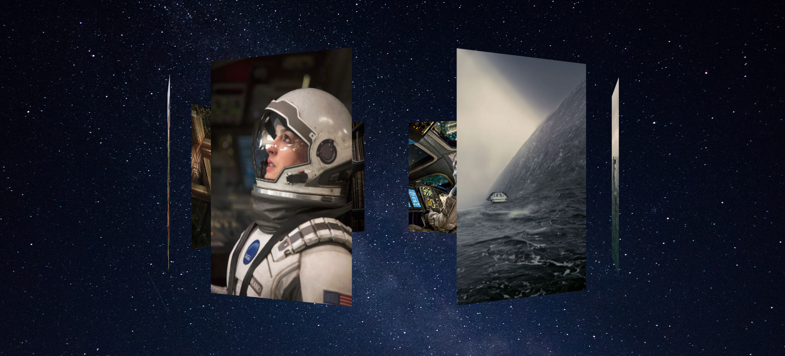

# CSS 3D Rotation Image Gallery



This repository is an example of an image gallery using 3D rotation created with CSS. The gallery provides an immersive experience while viewing images through dynamic and intuitive rotations.

## How It Works

The image gallery was developed using CSS properties to create three-dimensional rotation effects. Each image is displayed in an environment that allows users to rotate it and appreciate details from different angles.

## Features

- Smooth and responsive 3D rotation for images.
- User-friendly and interactive interface for image viewing.
- Easy to integrate into other projects.

## How to Use

1. Clone this repository:

    ```
    git clone https://github.com/your-username/css-3d-rotation-image-gallery.git
    ```

2. Open the `index.html` file in your browser.

## Contribution

Contributions are welcome! Feel free to open a pull request with improvements, bug fixes, or new features.

If you encounter any issues or wish to suggest an improvement, please open an issue in this repository.
